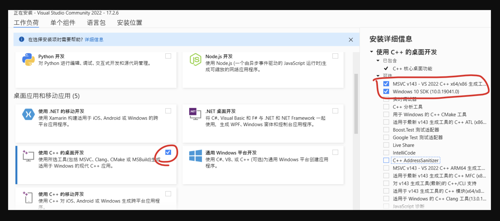
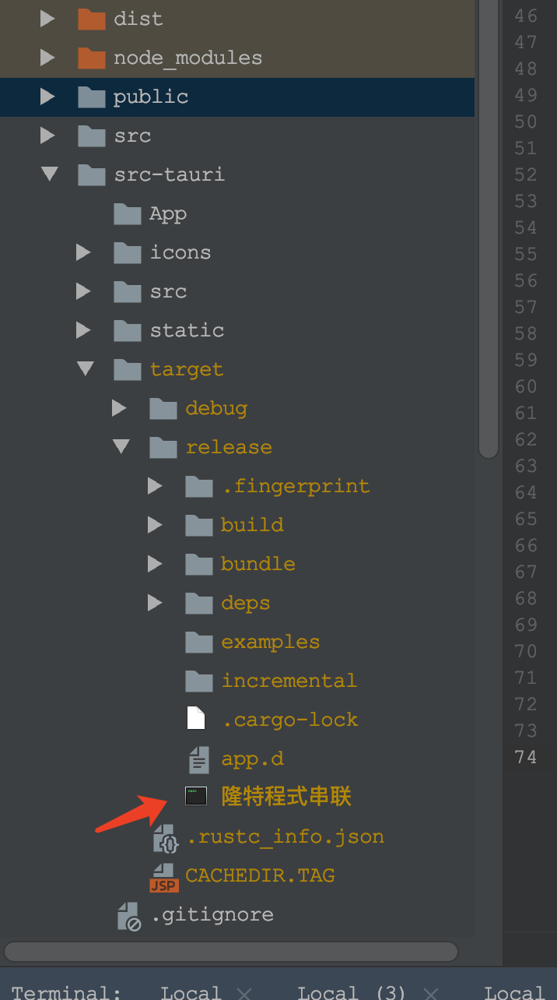
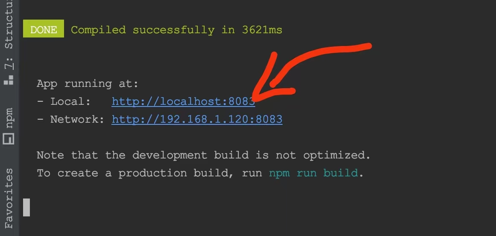

# vue combine
## 环境安装
- [Visual Studio C++ 依赖库安装](https://visualstudio.microsoft.com/zh-hans/visual-cpp-build-tools/) 勾上使用C++桌面开发
 

- [WebView2](https://developer.microsoft.com/en-us/microsoft-edge/webview2/#download-section) 选择常青版引导程序即可

- Rustc（[64位下载](https://win.rustup.rs/x86_64)｜[32位下载](https://win.rustup.rs/i686)）
    1. 检查是否安装成功  
      `rustc --version` //检查rust版本 <br>
      `cargo --version` //检查cargo版本 <br>
    2. 修改rust的Cargo源, 找到rust的安装目录 `C:\Users\[当前用户名]\.cargo`，新建 config 文件，注意不要添加后缀名；在config 文件添加下面的内容
        ```bash
        [source.crates-io]
        registry = "https://github.com/rust-lang/crates.io-index"
        
        # 替换成你偏好的镜像源
        replace-with = 'tuna'
        
        # 清华大学
        [source.tuna]
        registry = "https://mirrors.tuna.tsinghua.edu.cn/git/crates.io-index.git"
        ```
    3. 安装 `tauri-bundler`  和 `tauri-cli`   
    `cargo install tauri-bundler --force`  可能需要挺长时间，要不着急  
    `cargo install tauri-cli`
    
    
- [安装 node 环境](https://blog.csdn.net/m0_67393413/article/details/125345980)
- [安装代码编辑器vsCode](http://vscode.bianjiqi.net/)

## 目录说明
```$xslt
├── Aa.nc  
├── LICENSE  
├── LICENSE\ 2  
├── README.md          #帮助说明  
├── babel.config.js    #vue 配置文件  
├── dist               #vue 打包后的文件  
├── node_modules       #vue 依赖包  
├── package-lock.json  
├── package.json       #依赖包配置文件  
├── postcss.config.js  
├── public             #公共资源文件  
├── run-build.sh       #执行项目build的脚本  
├── run-dev.sh         #执行项目的脚本  
├── src                #vue 框架的代码  
    ├── api            #调用后端接口  
    ├── assets         #公用资源  
    ├── components     #组件  
    ├── router         #路由配置文件 
    ├── utils          #公共函数 
    ├── App.vue        #vue框架入口   
    └── main.js        #vue框架入口   
├── src-tauri          #tauri 框架  
    ├── App
    ├── icons
    ├── src    
        ├── main.rs    #rust 的调用入口 （可以在这里编写一些 rust api）     
    ├── static
    ├── target          #编译后的文件
    ├── Cargo.lock
    ├── Cargo.toml      #cargo 配置文件
    ├── build.rs
    ├── tauri.conf.json #tauri 项目配置文件
└── vue.config.js      #vue框架配置文件

```

## 项目运行
- 开发模式 `npm run tauri dev`
- 编译模式 `npm run tauri build` 生成的安装包在 release 文件里面
    
- 仅运行 vue 项目 ``npm run dev`` 双击 local 后面的连接
  

## 相关文档
### 前端
- [标签 html 学习文档](https://www.runoob.com/html/html-tutorial.html)
- [标签 css 学习文档](https://www.runoob.com/css/css-tutorial.html)
- [vue 学习文档](https://cn.vuejs.org/guide/essentials/template-syntax.html)
- [element-ui 学习文档](https://element.eleme.cn/#/zh-CN/component/layout)

### 后端
- [tauri 学习文档](https://tauri.app/v1/guides/debugging/application)
- [rust 学习文档](https://kaisery.github.io/trpl-zh-cn/ch01-00-getting-started.html)
